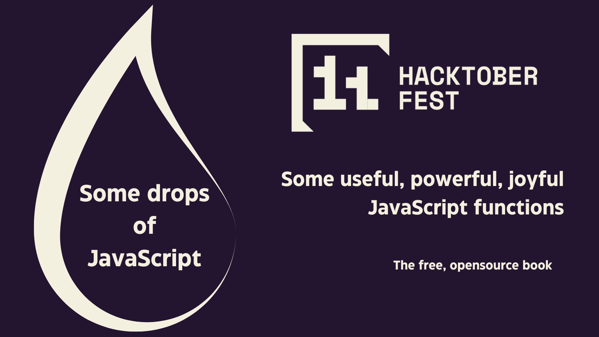

Hello amazing contributors! 👋

We are excited to invite you to join our Hacktoberfest celebration by contributing to our open-source book project. We welcome contributors with various skills and interests, so whether you're a JavaScript expert, a grammar enthusiast, a design aficionado, or just someone with a passion for learning and sharing knowledge, there's a place for you in our community.

## Ways to Contribute

Here are some of the ways you can get involved:

- **JavaScript Wizards**: Write pages for JavaScript functions, share your expertise, and help fellow developers understand some nice JavaScript functions.

- **Reviewers and Editors**: Help ensure the quality and accuracy of the content by reviewing and editing pages.

- **Grammar Enthusiasts**: Review and improve our documentation's English grammar and readability.

- **Idea Contributors**: Suggest JavaScript functions that should be covered in the documentation. Your insights are valuable!

- **Design Gurus**: Propose design changes that can enhance the overall user experience of our book.

## How to Get Started

1. Fork the repository to your GitHub account.
2. Create a new branch for your contributions.
3. Make your changes and commit them.
4. Open a pull request to merge your changes back into the main repository.

For more detailed instructions, please check our [Contribution Guidelines](https://github.com/roberto-butti/some-drops-of-javascript/blob/main/CONTRIBUTING.md).

## Join the Conversation

Have questions or want to discuss your contributions? Join us in the repository issue section, where you can create issues, suggestions, and feature requests.

## Say Thank You!

We deeply appreciate your willingness to contribute to the open-source book "Some Drops of JavaScript". Your efforts significantly impact the JavaScript community, and we're grateful for your support.

Happy Hacking! 🚀
